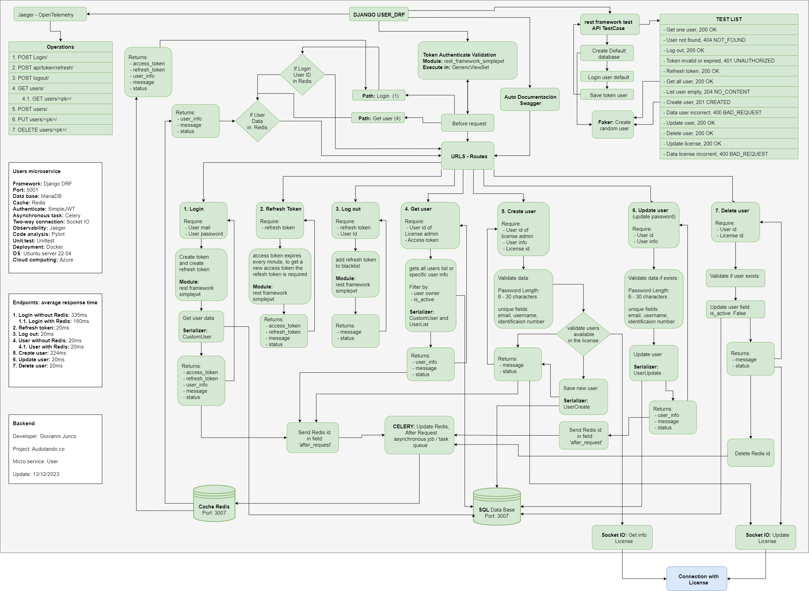
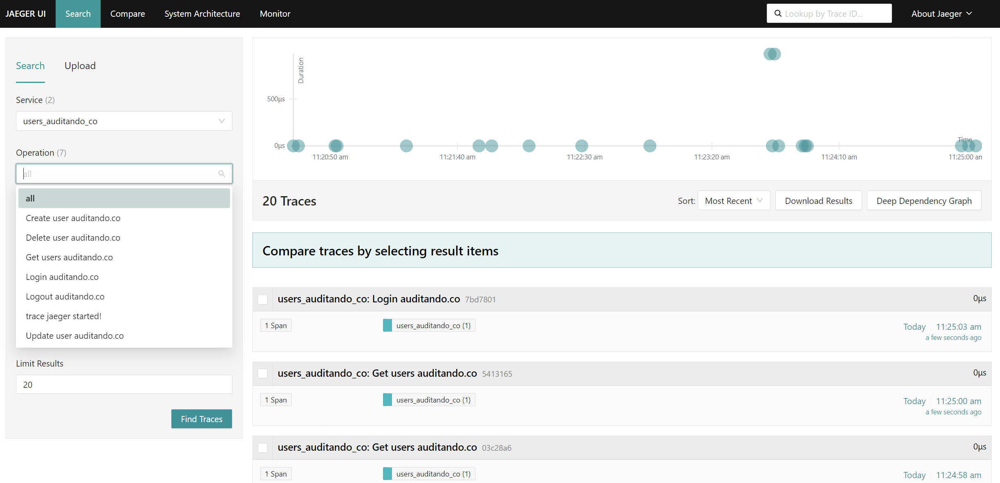

# Django DRF

Development of REST API for access to specific data through endpoints. Scalable ordered models (Model, Route, Controller), debugged python libraries with the best performance and advanced algorithms to deliver content to a debugged frontend.


## General diagram


## Specific diagram


### Initial Configuration

## start
```bash
django-admin startproject Users_DRF

python -m venv .users_auditando_co
.users_auditando_co\Scripts\activate
pip install -r requirements.txt
python manage.py runserver 0.0.0.0:5001

django-admin startapp user_app
python manage.py makemigrations
python manage.py migrate

python manage.py makemigrations user_app
```

## ubuntu
```bash
apt install python3.8-venv
python3 -m venv .users_auditando_co
source .users_auditando_co/bin/activate

pip3 install -r requirements.txt

python3 manage.py makemigrations
python3 manage.py migrate
python3 manage.py runserver 0.0.0.0:5001


```
## user/admin

```bash
python manage.py createsuperuser
Username: userAdmin
Correo Electrónico: giovannyjunco@gmail.com
Nombres: Giovanni
Apellidos: Junco
Password: aqHT7854+
This password is too common.
Bypass password validation and create user anyway? [y/N]: y
Superuser created successfully.

python manage.py runserver
```

probar el acceso a admin

http://127.0.0.1:8000/admin/

hasta aca django normal


## Token

token: conjunto de caracteres aleatorios sirve para validar usuario en vez de envioar usuario y contraseña
JWT :(json web token) encapsular y compartir claims (caracteristicas request). 
    -tienen firma digital: RFC 7515 - se pueden generar con claves simetricas o asimetricas
    - datos cifradoas: contiene datos sensibles (no colocar contraseñas)
    las tres partes de un token se puede ver en jwt.io
    
    https://django-rest-framework-simplejwt.readthedocs.io/en/latest/

https://django-rest-framework-simplejwt.readthedocs.io/en/latest/getting_started.html

## migraciones
para eliminar migraciones:
limpiar la base de datos con: python manage.py flush
luego eliminar todas las carpetas migrations

## documentacion swagger

instalar drf-yasg
autodocumentacion: en views (api.py) usar GenericViewSet para que swagger tome todas las rutas y modelos automaticamente

https://drf-yasg.readthedocs.io/en/stable/readme.html

## redis

Redis (REmote DIctionary Server) es un almacén de datos NoSQL de código abierto en memoria que se utiliza principalmente como caché de aplicaciones o base 

Iniciar redis en windows cmd: redis-server

validar: redis-cli  get Gioabcd123

ver colas de celery: llen celery

clear:  flushall  or flushall async

ver todo scan 0

## rabbitMQ

software de negociación de mensajes de código abierto que funciona como un middleware de mensajería. Implementa el estándar Advanced Message Queuing Protocol.

https://www.youtube.com/watch?v=KhYiaEOrw7Q&ab_channel=ProgrammingKnowledge

ver plugings: rabbitmq-plugins.bat list
habilitar pluging: rabbitmq-plugins.bat enable rabbitmq_management

1. Download RabbitMQ Installer: Go to the official RabbitMQ website (www.rabbitmq.com) and download the Windows installer suitable for your system architecture (32-bit or 64-bit).

2. Run Installer: Once the installer is downloaded, double-click on it to run the installation wizard.

3. Install RabbitMQ: Follow the installation wizard steps to install RabbitMQ on your Windows 11 system. You can choose the installation directory and other configurations during the process.

4. Start RabbitMQ Service: After the installation is complete, open the Windows Services Manager by searching for "Services" in the Start menu. Find the "RabbitMQ" service in the list, right-click on it, and select "stoping" and "Start" to start the RabbitMQ service.

5. Access RabbitMQ Management Interface: Open your web browser and go to http://localhost:15672/. This will take you to the RabbitMQ Management Interface.

6. Log in: Log in to the RabbitMQ Management Interface using the default credentials (username: "guest" and password: "guest"). It is essential to change the default password for security reasons.

7. Create Queues and Exchanges: In the RabbitMQ Management Interface, you can create queues, exchanges, and bindings to facilitate communication between applications.

## celery

es una cola de trabajos/tareas asincrónicas basada en mensajes distribuidos. Esta se centra principalmente en las operaciones en tiempo real

pip install eventlet

celery -A Users_DRF worker --loglevel=info -P eventlet

## PyLint

python -m pylint .\user_app\wiews.py

en la carpeta raíz: pylint_runner

## Unit test
rest_framework.test import APITestCase
python -m unittest app\test\test_graphql.py

---
factory = generador de datos para las pruebas
apitestcase = clase de drf para realizar pruebas unitarias hereda de unittest
faker = libreria permite crear informacion falsa para las pruebas
se necesita crear un usuario default para las pruebas

run: python manage.py test

## Jaeger - Monitoring

Docker: Getting Started — Jaeger documentation (jaegertracing.io)

docker run --rm --name jaeger   -e COLLECTOR_ZIPKIN_HOST_PORT=:9411   -p 6831:6831/udp   -p 6832:6832/udp   -p 5778:5778   -p 16686:16686   -p 4317:4317   -p 4318:4318   -p 14250:14250   -p 14268:14268   -p 14269:14269   -p 9411:9411   jaegertracing/all-in-one:1.51

http://192.168.1.112:16686/
http://localhost:16686/




## Mariadb

mysql -u root -p

CREATE DATABASE auditando_db;

User:
GRANT ALL ON auditando_db.* to 'dbadmin'@'%' IDENTIFIED BY 'myPassword';

mysql -u dbadmin -p

## Postgresql

sudo -u postgres psql

create user dbadmin with encrypted password 'myPassword';

CREATE DATABASE auditando_db;

grant all privileges on database auditando_db to dbadmin;

GRANT ALL ON DATABASE auditando_db TO dbadmin;
ALTER DATABASE auditando_db OWNER TO dbadmin;
GRANT USAGE, CREATE ON SCHEMA PUBLIC TO dbadmin;

ALTER ROLE dbadmin SET client_encoding TO 'utf8';
ALTER ROLE dbadmin SET default_transaction_isolation TO 'read committed';
ALTER ROLE dbadmin SET timezone TO 'UTC';

GRANT ALL PRIVILEGES ON DATABASE auditando_db TO dbadmin;

salir: \q

## Docker compose

docker compose up
